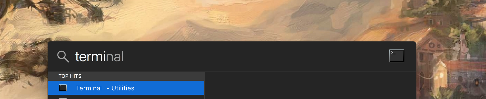
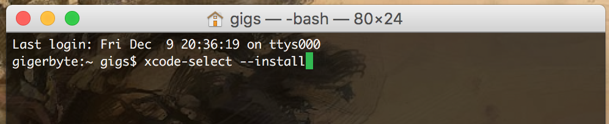

# Installing The Tools - Windows

---

# Atom - Installing The Tools 

1. go to https://atom.io
2. Download the 'windows installer'
3. Install

---
# Git - Version Control System

1. Download and Install the Commandline tools:
2. Open terminal

3. Type ```xcode-select --install```

4. install Homebrew and type:

 ```/usr/bin/ruby -e "$(curl -fsSL https://raw.githubusercontent.com/Homebrew/install/master/install)"``` 
and press enter
5. type ```brew install git```

---
# NodeJS - Dependency Installer

1. type ```brew install node```