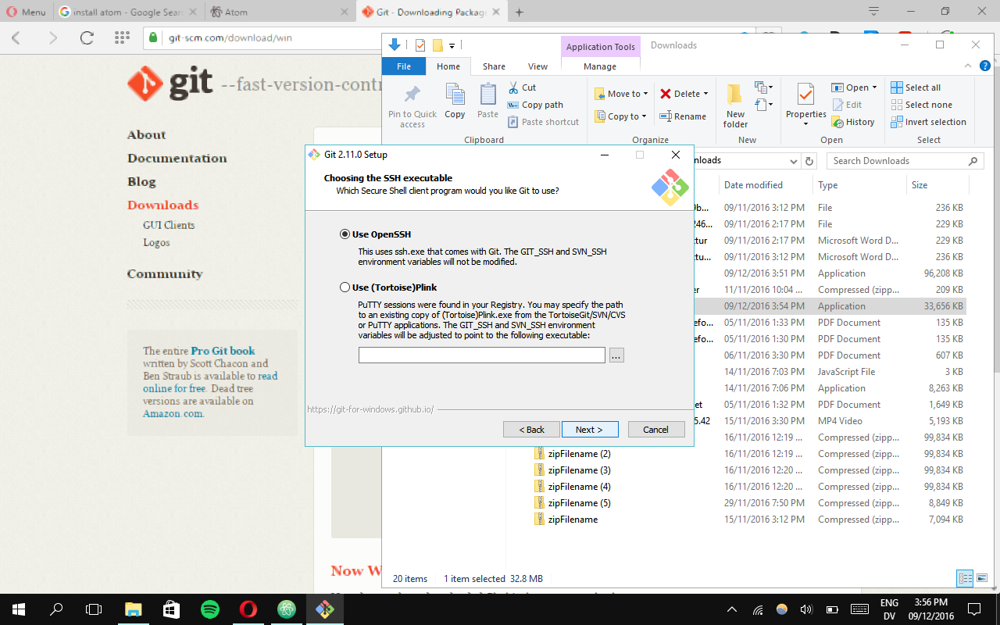

# Installing The Tools - Windows

---

# Atom - Installing The Tools 

1. go to https://atom.io
2. Download the 'windows installer'
3. Install

---
# Git - Version Control System

1. go to https://git-scm/download/win
2. Choose the 64-bit version & Save to downloads

3. Install
4. Use the default options: See the images below:

---
# NodeJS - Dependency Installer

1. go to https://nodejs.org/en
2. go to Windows